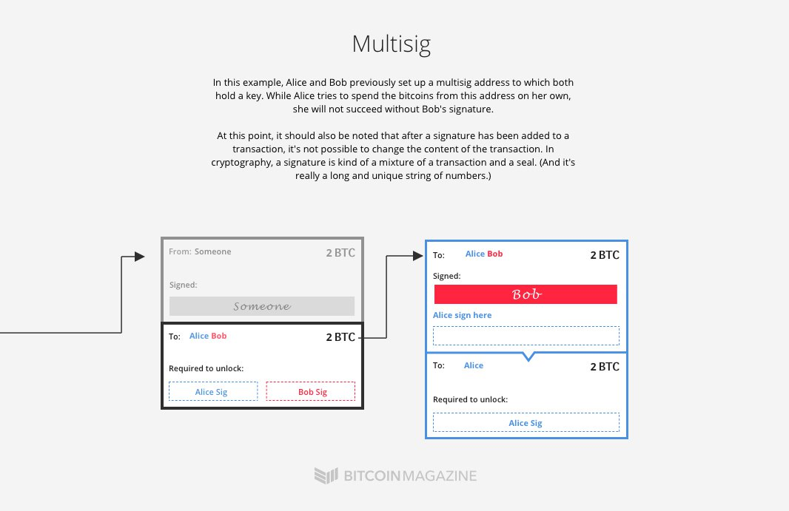
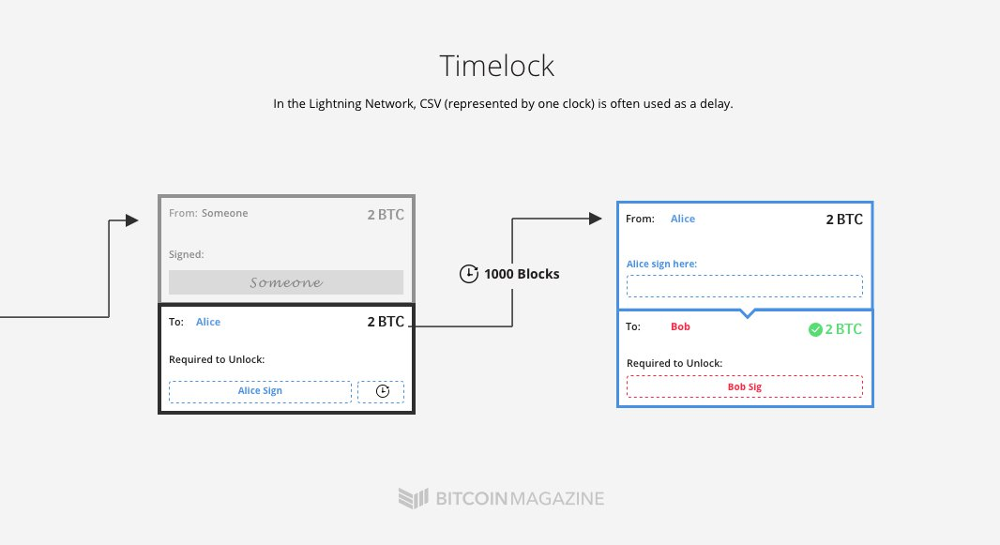
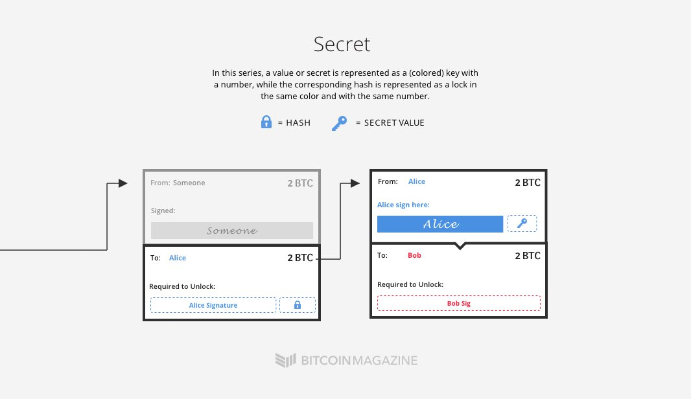
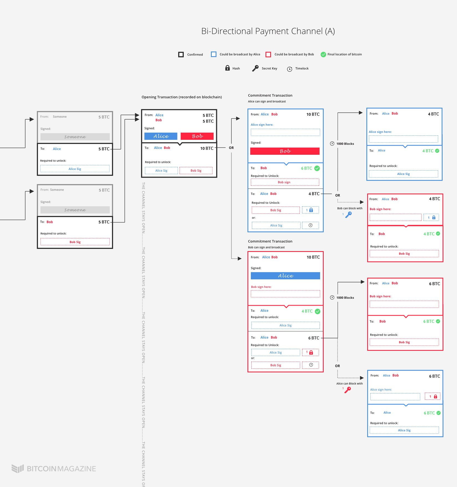

Lightning Network
=================

Requirements
------------
* `SIGHASH_NOINPUT` opcode included in Segwit soft fork that allows spends to be created on transactions that haven't been signed yet.
* 2-of-2 multisig:

* Time lock transactions

* Output reveal secret

Approach
---------
Create a funding transaction that is a 2-of-2 multisignature trasnactions but **don't** sign it until Alice and Bob have both created child spend transactions that refund the money back to them.
The `SIGHASH_NOINPUT` opcode lets you do this since signature is not part of txid anymore.

Order of Operations:
1. Create the parent (Funding Transaction)
2. Create the children (Commitment Transactions and all spends from the commitement transactions).
3. Sign the children.
4. Exchange the signatures for the children.
5. Sign the parent.
6. Exchange the signatures for the parent.
7. Broadcast the parent on the blockchains.

Commitment transactions track the current balance of the channel since they are not broadcast to the network. With one commitment transaction exchanged, Alice and Bob can both get their refund.
Only broadcast commitment transactions when you want to close the channel.

**Necessary Property**: Each party can only broadcast the latest state of the channel otherwise incur a penalty or lose deposit. Need to: blame someone for violation, need to acct on the blame to penalize.

### Naive (Broken) Approach - No Ability to Ascribe Blame
When both parties change the state of the channel (update the Commitment Transaction, CT) they both sign the transaction first and once the Funding Transaction, FT, is in the blockchain the CT can be broadcast.
When a user wants to update the channel, though, there are now two valid spends of FT and we have a race to include in the blockchain: funds stolen/incorrect state recorded/channel closed.
<pre>
                                           +------------------------+
                             +-----------> | Alice = 0.5, Bob = 0.5 | (Old state signed by both)
+---------------------+      |             +------------------------+
| Funding Transaction | ---- +                                                                  ==> no way to differentiate the two CTs because they were both signed by both people from the beginning.
+---------------------+      |             +------------------------+
                             +-----------> | Alice = 0.4, Bob = 0.6 | (Newest state signe by both)
                                           +------------------------+
</pre>             

- [ ] Ascribe blame to broadcaster of old state.
- [ ] Penalize broadcaster of old state.

**Note**: _Fidelity Bond_: a form of insurance protection that covers policyholders for losses that they incure as a result of fraudulent acts be specified individuals.

### Naive (Broken) Approach - No Ability to Punish after Blame
You only know who sent out an old transaction if each of Alice and Bobe have a uniquely identifiable Commitment Transaction.
Instead of one CT, there are two CTs one for each of Alice and Bob (they both spend FT but have *different* contents).
Bob signs one CT and sends it to Alice. Alice signs another and sends it to Bob.
Bob has CT1 signed by Alice and Alice has CT2 signed by Bob: either party can now sign the version of the CT they have and broadcast it to the network.
You can distinguish between CT1 and CT2 so we can assign blame for every CT broadcast to the blockchain.
<pre>
                                           +------------------------+
                             +-----------> | Alice = 0.5, Bob = 0.5 | (CT1, signed by Alice)
+---------------------+      |             +------------------------+
| Funding Transaction | ---- +                                                                  ==> each party can only broadcast a CT already signed by the counterparty, so source of CT can be identified.
+---------------------+      |             +------------------------+
                             +-----------> | Alice = 0.4, Bob = 0.6 | (CT2, signed by Bob)
                                           +------------------------+
</pre>

- [x] Ascribe blame to broadcaster of old state.
- [ ] Penalize broadcaster of old state.

But... still not way to penalize.

### Approach - Ascribe Blame and Punish Violator

Keep relatively the same structure as before, but this time the commitment transactions are updated with a unique output. 
Alice and Bob exchange self-signed half transactions with each other that include how much they are going to be payed.
For example, Alice creates a transaction where one output pays herself 4 BTC and the other output is a multi-sig.
There are two ways to redeem the multisig:
1. Bob can sign the output and receive the funds after a time lock of ~1000 blocks. Once the time has elapsed he only needs to sign the output and can claim the funds.
2. The other way is for Alice to use the secret whose hash Bob has given her to claim the output before Bob's 1000 block timelock runs out.

The second case is what prevents the rebroadcasting of old states by Bob. Whenever, the commitment trasnactions are updated, Bob and Alice shared the pre-images of the hashes they used in the precious CTs.
Since Alice now knows the pre-images of the hash, if Bob attempts to broadcast an old state, Alice can unilaterally sign the output, provide the secret and claim all of Bob's bitcoin before his 1000 block timelock runs out.

